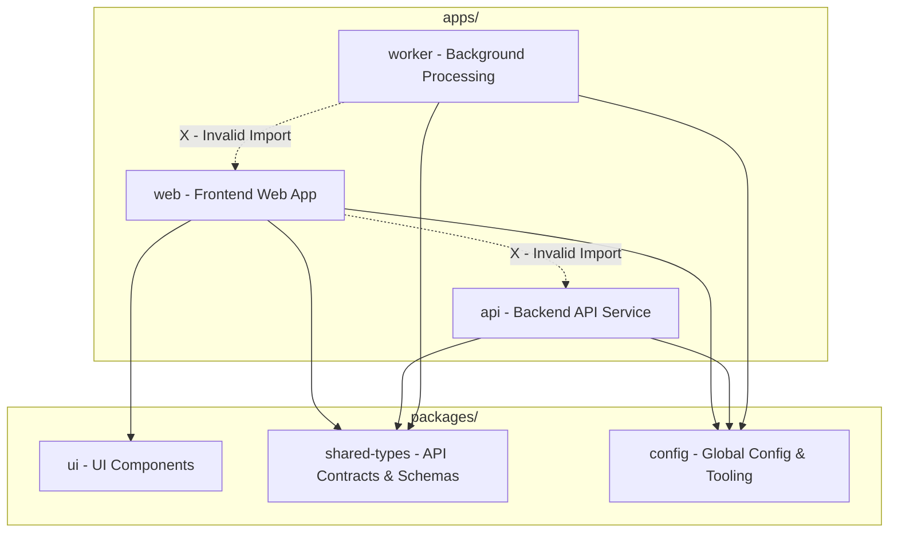

# Application Boundaries

This document defines the architectural boundaries and import restrictions between the applications inside the `apps/` directory and the shared libraries inside the `packages/` directory of the `tax-ai` monorepo.

---

## Architectural Principles

1. **Independent Deployability**: Every application inside [`apps/`](file:///c:/Users/navne/EasyTaxInd/tax-ai/apps) must be self-contained and independently deployable. They should not rely on build-time components of other applications.
2. **Zero Cross-Application Imports**: Applications must never directly import code or assets from other applications (e.g., code in `apps/web` must not import from `apps/api`).
3. **Shared Code Extraction**: Any code, schema, utility, or UI element that needs to be shared between two or more applications must be extracted into a package inside [`packages/`](file:///c:/Users/navne/EasyTaxInd/tax-ai/packages).

---

## The Monorepo Application Boundaries

Below is a map of the default applications in [`apps/`](file:///c:/Users/navne/EasyTaxInd/tax-ai/apps) and their specific structural roles.

### 1. [`apps/web/`](file:///c:/Users/navne/EasyTaxInd/tax-ai/apps/web) (Frontend)
The user-facing browser application.
* **Boundary Rule:** `web` runs purely in the client browser. It must never import backend code, database connections, or server-side utility modules.
* **Communications:** Communicates with `apps/api` strictly via HTTP REST or WebSocket protocols, using interfaces defined in `packages/shared-types`.

### 2. [`apps/api/`](file:///c:/Users/navne/EasyTaxInd/tax-ai/apps/api) (Backend API)
The primary server-side API entry point.
* **Boundary Rule:** Handles HTTP requests and coordinates database or caching resources. It must never import frontend assets, client routing code, or UI libraries (e.g., React, Tailwind).
* **Communications:** Serves requests from `apps/web`, writes tasks to message queues (e.g., Kafka/Redis) for `apps/worker` to pick up.

### 3. [`apps/worker/`](file:///c:/Users/navne/EasyTaxInd/tax-ai/apps/worker) (Background Worker)
A headless consumer that processes asynchronous tasks, cron jobs, and queues.
* **Boundary Rule:** Must not include any web-serving controllers, frontend UI logic, or UI dependencies.
* **Communications:** Listens to events/queues written by `apps/api` and performs long-running background tasks.

---

## Import & Dependency Rules Matrix

The following matrix defines which references are permitted across the workspace:

| Importing Module | May Import From `apps/web/` | May Import From `apps/api/` | May Import From `apps/worker/` | May Import From `packages/*` |
| :--- | :---: | :---: | :---: | :---: |
| **`apps/web/`** | ✅ | ❌ *Forbidden* | ❌ *Forbidden* | ✅ *Allowed* |
| **`apps/api/`** | ❌ *Forbidden* | ✅ | ❌ *Forbidden* | ✅ *Allowed* |
| **`apps/worker/`** | ❌ *Forbidden* | ❌ *Forbidden* | ✅ | ✅ *Allowed* |
| **`packages/*`** | ❌ *Forbidden* | ❌ *Forbidden* | ❌ *Forbidden* | ✅ *Allowed* |

---

## Enforcement & Best Practices

* **Linting Rules**: Dependency boundaries should be statically enforced using ESLint rules (such as `eslint-plugin-import` with restricted paths) or TypeScript path constraints.
* **Adding New Apps**: When adding a new application to `apps/`, verify that its build configurations (e.g., `Dockerfile`, `package.json`) do not point to paths inside other applications.
* **Decoupling Database Models**: `apps/worker` and `apps/api` may share access to the database, but they should share model schemas via a database package in `packages/` (e.g., `packages/db-client/`) rather than importing direct files from each other.
