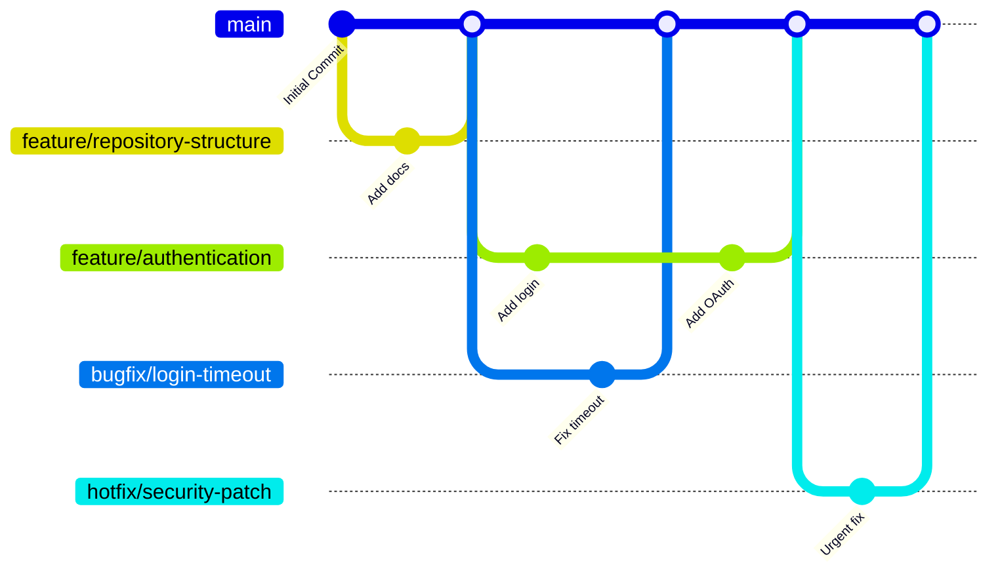

# Branching Strategy

This document establishes the official branching strategy and pull request workflow for the `tax-ai` repository. We use a simplified trunk-based branching model to keep development moving quickly, prevent merge debt, and maintain continuous delivery to production.

---

## Branching Model Visual

All work branches branch off `main` and are merged back into `main` after review and verification.



---

## Branch Types

| Branch Pattern | Purpose | Lifetime | Target Parent |
| :--- | :--- | :--- | :--- |
| `main` | Production-ready, stable code | **Permanent** | *N/A* |
| `feature/*` | Development of new features or user stories | **Short-lived** (deleted after merge) | `main` |
| `bugfix/*` | Resolutions for non-critical bugs found during QA/staging | **Short-lived** (deleted after merge) | `main` |
| `hotfix/*` | Immediate resolutions for critical bugs affecting production | **Short-lived** (deleted after merge) | `main` |

## Branch Naming Rules

To keep the repository history readable and automate workflow tracking, all branch names must be **lowercase** and use **kebab-case** (words separated by hyphens) following their type prefix.

### Prefixes and Patterns
* **Features:** `feature/<kebab-case-description>`
* **Bug Fixes:** `bugfix/<kebab-case-description>`
* **Hot Fixes:** `hotfix/<kebab-case-description>`

### Comparison and Standards

| Category | Allowed / Recommended | Disallowed / Avoid | Rationale |
| :--- | :--- | :--- | :--- |
| **Case & Format** | `feature/user-authentication`<br>`feature/rag-search`<br>`feature/github-actions` | `Feature/Auth`<br>`feature_auth`<br>`NewFeature` | Mix of casing, underscores, or lack of prefix breaks automation and directory grouping |
| **Bug Fixes** | `bugfix/login-timeout` | `bug/login`<br>`fix-login` | Use standard `bugfix/` prefix for consistency |
| **Hot Fixes** | `hotfix/openai-api-error` | `urgent-fix`<br>`hotfix_api` | Use standard `hotfix/` prefix |

---

## Branch Lifecycle Rules

All developers must follow these lifecycle rules to ensure codebase health and simplify release tracking:

1. **Branch from the Latest `main`**: Always create new branches from the most up-to-date state of the `main` branch to avoid resolving stale merge conflicts.
   ```bash
   git checkout main && git pull origin main
   git checkout -b feature/your-feature-name
   ```
2. **One Scope Per Branch**: Restrict branches to a single feature or bug fix. Never bundle unrelated changes (e.g. fixing a UI alignment bug inside a feature branch for database migration).
3. **Rebase Strategy for Syncing**: If the remote `main` branch moves ahead while you are working:
   * **Required Strategy**: Use **Rebase** to pull in updates (`git pull --rebase origin main`).
   * This maintains a clean, linear commit history free of intermediate merge commits. Avoid mixing `git merge main` into local branches.
4. **Delete Branches Post-Merge**: Local and remote branches must be deleted immediately after a Pull Request is squash-merged into `main`.
5. **Never Reuse Old Branches**: Once a branch has been merged, it is dead. Do not push subsequent changes or fixes to that same branch. Always branch anew from `main`.

---

## Key Development Rules


1. **Avoid Long-Lived Intermediate Branches**: Do not create or maintain permanent `develop` or `release` branches. Integrating all features directly back into `main` ensures the entire repository stays integrated and reduces merge conflicts.
2. **Branch Naming Standard**: Always follow the patterns defined in [Branch Naming Rules](#branch-naming-rules) when creating new workspace branches.
3. **Pull Request Workflow**:
   * All modifications to `main` must be submitted via a Pull Request (PR).
   * PRs must pass all automated status checks (linting, building, test suites) before they can be merged.
   * Delete source branches immediately after merging to keep the repository clean.

