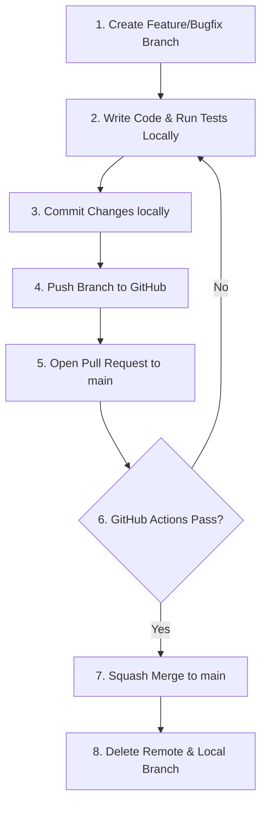

# Development Workflow

This document defines the step-by-step development lifecycle for contributing code to the `tax-ai` repository. Following this workflow ensures code quality, keeps the commit history clean, and maintains continuous integration stability.

---

## Visual Workflow Diagram

All code contributions must progress through the following phases:



---

## Step-by-Step Breakdown

### 1. Create Feature or Bugfix Branch
Start by checking out the latest `main` branch and creating a new branch locally. Follow the [Branch Naming Rules](file:///c:/Users/navne/EasyTaxInd/tax-ai/docs/development/branch-strategy.md#branch-naming-rules) exactly.
```bash
git checkout main
git pull origin main
git checkout -b feature/your-feature-name
```
> [!IMPORTANT]
> **No direct commits to `main` are allowed.** Direct pushes to the `main` branch are blocked by repository protection rules.

### 2. Write Code & Run Tests
Make your code changes, ensuring you follow established [Naming Conventions](file:///c:/Users/navne/EasyTaxInd/tax-ai/docs/development/naming-conventions.md) and [Application Boundaries](file:///c:/Users/navne/EasyTaxInd/tax-ai/docs/development/application-boundaries.md). Verify your work locally (e.g. running linters and unit tests).

### 3. Commit Changes
Commit your modifications with clear, descriptive commit messages. Group logical parts of your change into separate, atomic commits.
```bash
git add .
git commit -m "feat: implement user login OAuth provider"
```

### 4. Push Branch to GitHub
Publish your local branch to the remote repository.
```bash
git push origin feature/your-feature-name
```

### 5. Open a Pull Request (PR)
Navigate to GitHub and create a Pull Request targeting the `main` branch. Provide a comprehensive description of the changes, reference any related issues, and fill out the PR template.

### 6. GitHub Actions Verification
Once the PR is opened, the automated CI pipeline ([`ci.yml`](file:///c:/Users/navne/EasyTaxInd/tax-ai/.github/workflows/ci.yml)) will trigger to run test suites, check linter compliance, and verify build compatibility.
* **If checks fail:** Resolve the errors locally, commit, and push updates. The PR will automatically re-run checks.

### 7. Squash Merge
After obtaining approvals and once all CI checks pass, merge the PR using **Squash and Merge**. This condenses all feature commits into a single, clean commit on `main`.

### 8. Delete Branch
Clean up the branch to keep the workspace tidy.
* **GitHub:** Click the "Delete branch" button on the PR page.
* **Local Workspace:**
  ```bash
  git checkout main
  git pull origin main
  git branch -d feature/your-feature-name
  ```
