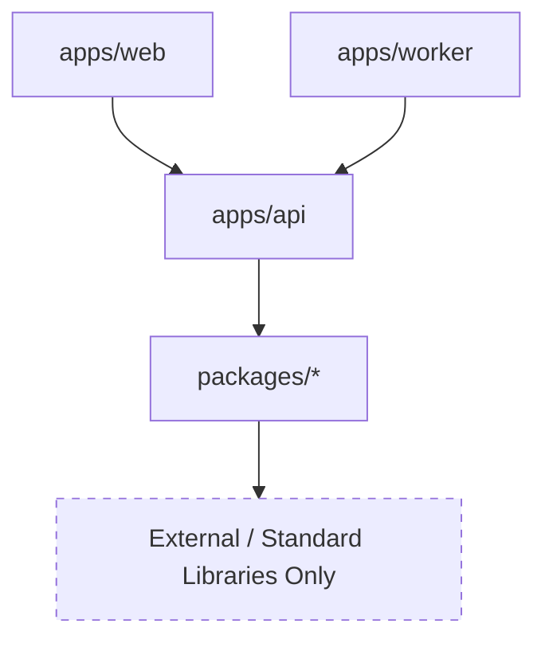

# Import Rules

This document establishes the official import rules and dependency hierarchy across the `tax-ai` monorepo. Defining a strict top-down dependency graph prevents circular dependencies, reduces compilation times, and ensures shared libraries remain truly decoupled.

---

## Dependency Hierarchy Graph

The workspace follows a strict unidirectional dependency model. Code in a given tier may only import or depend on code in the tiers below it.

---

## Rules by Module

### 1. `apps/web/`
* **May Depend On:** [`apps/api/`](file:///c:/Users/navne/EasyTaxInd/tax-ai/apps/api) (for shared type endpoints, request/response models, or client helpers), and [`packages/`](file:///c:/Users/navne/EasyTaxInd/tax-ai/packages).
* **Must Not Depend On:** `apps/worker/`.

### 2. `apps/worker/`
* **May Depend On:** [`apps/api/`](file:///c:/Users/navne/EasyTaxInd/tax-ai/apps/api) (for core business modules, database instances, or server utilities), and [`packages/`](file:///c:/Users/navne/EasyTaxInd/tax-ai/packages).
* **Must Not Depend On:** `apps/web/`.

### 3. `apps/api/`
* **May Depend On:** [`packages/`](file:///c:/Users/navne/EasyTaxInd/tax-ai/packages) (reusable libraries, shared models, config).
* **Must Not Depend On:** `apps/web/` or `apps/worker/`.

### 4. `packages/`
* **May Depend On:** Only external libraries or other packages in `packages/` (provided they do not form a cycle).
* **Must Not Depend On:** Any application directories under `apps/` (i.e. `web`, `api`, or `worker`).

---

## Summary Matrix

The following table summarizes the allowed file imports between directories:

| Importing Directory | import from `apps/web/` | import from `apps/api/` | import from `apps/worker/` | import from `packages/` |
| :--- | :---: | :---: | :---: | :---: |
| **`apps/web/`** | ✅ | ✅ | ❌ | ✅ |
| **`apps/worker/`** | ❌ | ✅ | ✅ | ✅ |
| **`apps/api/`** | ❌ | ✅ | ❌ | ✅ |
| **`packages/`** | ❌ | ❌ | ❌ | ✅ |

---

## Why these rules matter

* **Preventing Circular Dependencies:** When application files reference package code, and package code refers back to applications, it creates circular build-time dependencies that break build systems (Vite, Webpack, tsconfig paths).
* **True Reusability:** If a package in `packages/` imports from `apps/api`, it cannot be consumed by `apps/web` or any other application without pulling in all of `apps/api`'s transitive node modules and runtime configurations. Keeping `packages/` leaf nodes in the tree guarantees ease of code reuse.
